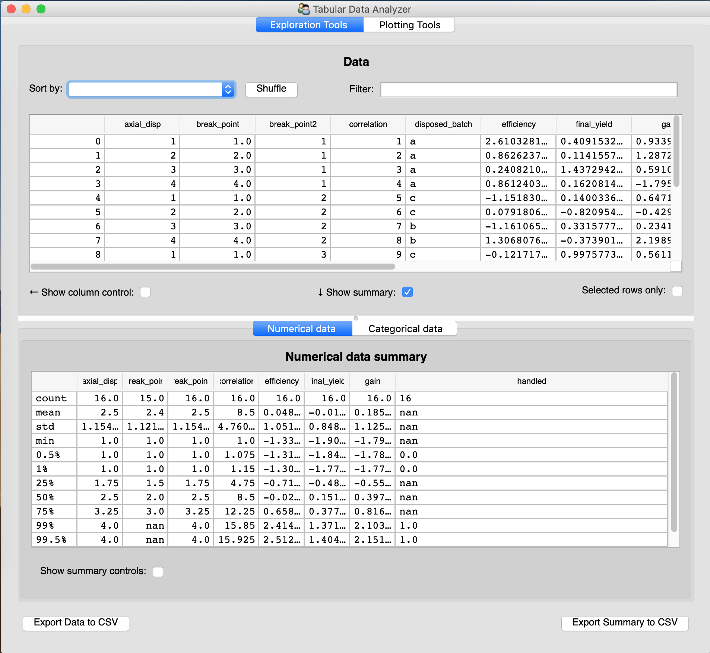
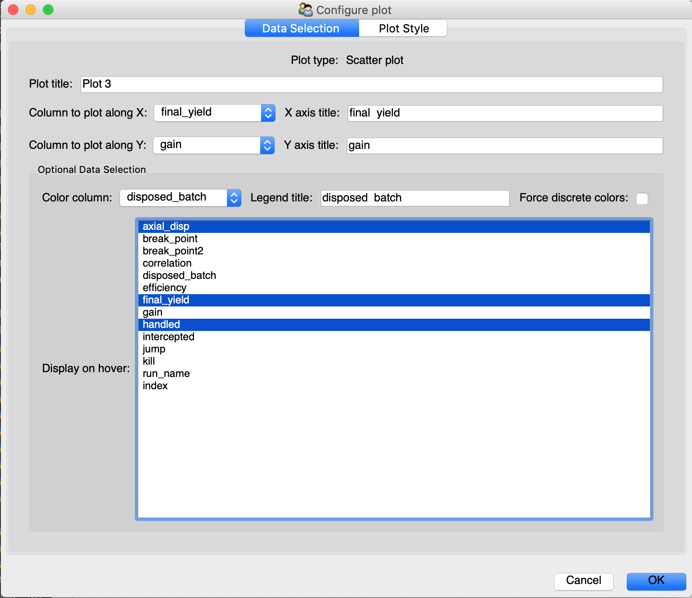
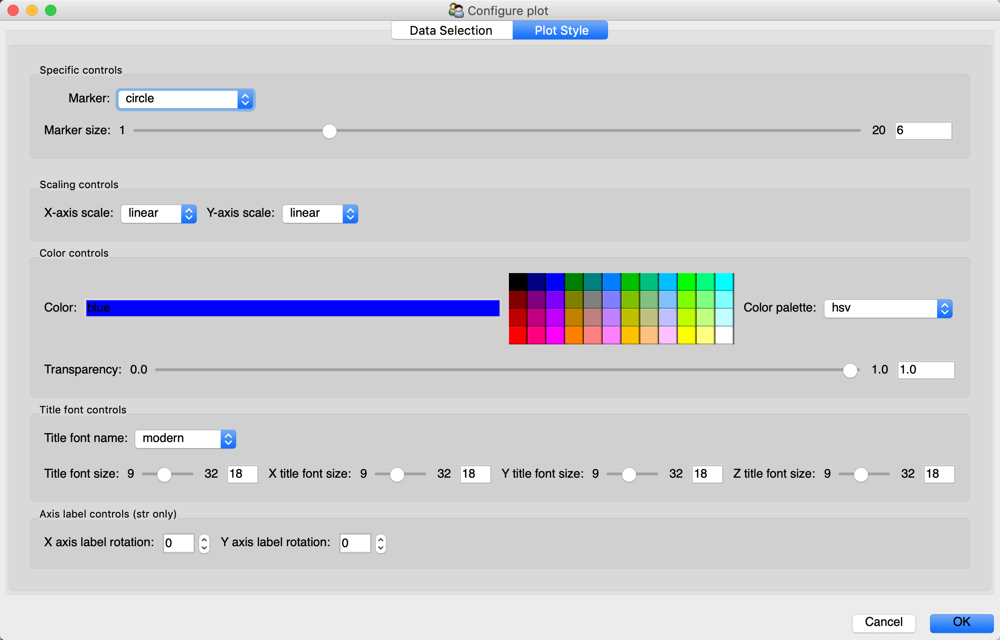
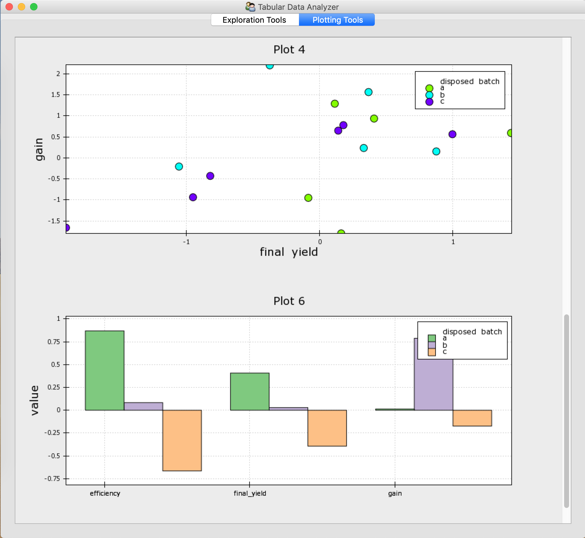
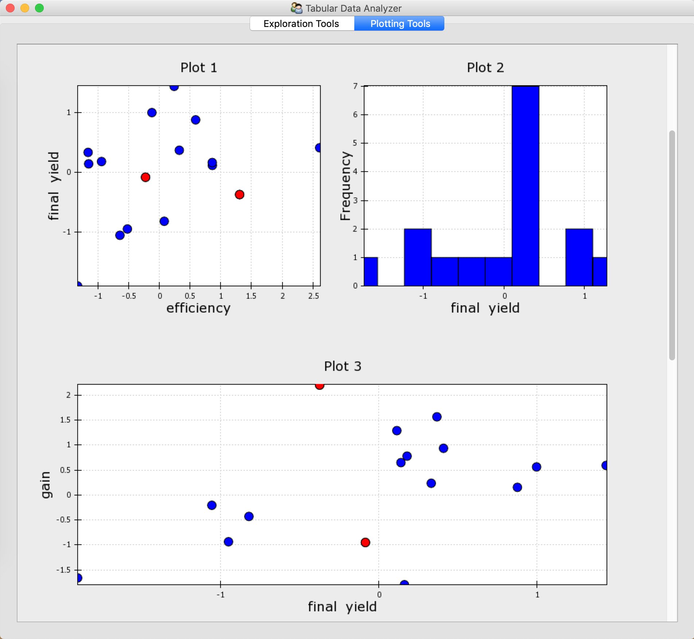
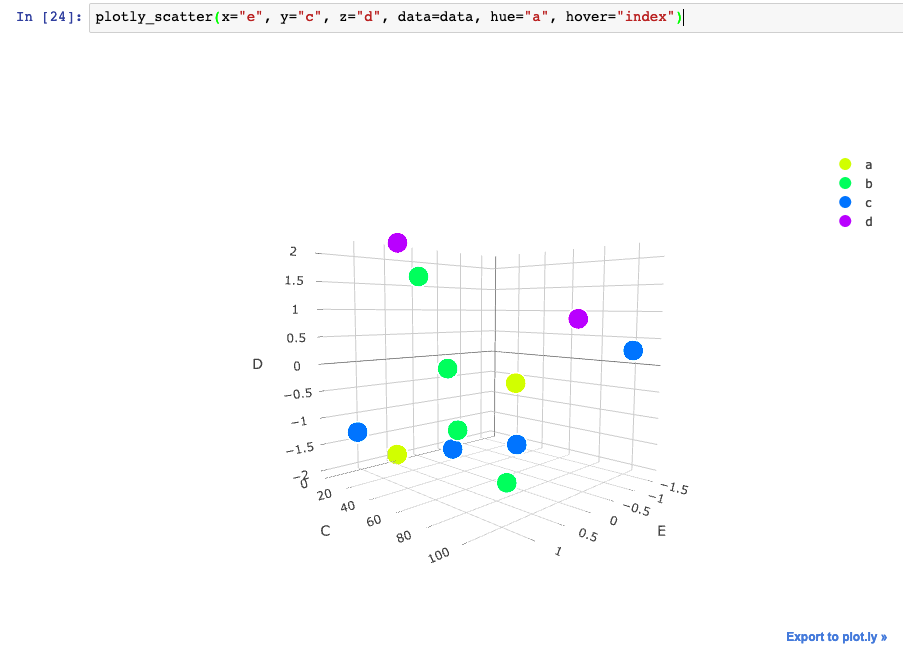

# pybleau

| Linux, OSX  | [](https://travis-ci.org/KBIbiopharma/pybleau)|
| ----------- | ----------- |
| Windows     | [](https://ci.appveyor.com/project/jonathanrocher/pybleau/branch/master)|


## Project stage
Though used in production by multiple projects, this project is still under
active development, in pre-1.0 stage, and may therefore occasionally break
backward compatibility. Minor version number will be bumped when that's the
case. Refer to the changelog for details.

## Purpose
This repo's name is inspired by the `tableau` data exploration platform and its 
purpose is to interactively explore and visualize Pandas dataframes and explore 
these explorations. It provides a desktop application (or embeddable desktop 
app components) for interactive data exploration and export capabilities to 
build simple and interactive reports.

It contains 2 parts. The `app` sub-module contains reusable components for 
desktop data exploration using the Enthought Tool Suite (TraitsUI, Chaco, ..., 
see http://code.enthought.com/). An analysis can be exported from the desktop 
app using a json file using the Vega-Lite format, and converted to reports in 
various formats (Dash, ...) using the `reporting` submodule. For now, it only 
contains tools to build web-based visualization reports using Plotly/Dash. To 
support these translations, `vega_translators` contains utilities to translate 
plots and translate it into plotly or Chaco plots.

The project provides 2 entry-points for high-level tools it contains: 
  - `pybleau_app` to launch the desktop DF exploration application
  - `pybleau_report` to create a report from a json analysis description file.


## Installation

### Requirements

For all components:
  - Python 3.6+
  - pandas (> 0.24 recommended)
  - app_common 0.12.7+

For ETS app tools:
  - traitsUI 6.0+ (>7.0.1 recommended), traits, pyface
  - a UI toolkit (qt5 or wx): see ETS documentation for details.

For the plotting portion of the ETS app tools:
  - chaco 4.7, enable, kiwisolver.
  - seaborn 0.9

For plotly/dash tools:
  - plotly 3.10
  - dash 1.0, dash_auth
  - matplotlib 2.0
  
For report generation:
  - python_pptx 0.6
 
For development:
  - flake8
  
 
For complete list of dependencies, please refer to `ci/requirements.json` for 
the content of the environment used to test pybleau in CI.

### Installation steps

To install pybleau within an existing Python environment, end-users should 
install `pybleau` itself using: 
```bash
python setup.py install
```

Developers should clone this repository and run
```bash
python setup.py develop
```

## Package content and design

### An App for custom exploration of tabular data
The `app` submodule of the project compose a desktop application providing 
analysts a limited but coherent set of tools enabling the following 
capabilities:
  * viewing the tabular data, sorting, shuffling and filtering it,
    
  * viewing a customizable statistical summary of each column (bottom portion 
    of the screenshot above),
  * generating polished plots with a graphical interface accessible to anyone,
    
    
  * plotting columns as line plots, bar plots, scatter plots, histograms 
    (binned frequencies), and heatmaps,
    
  * viewing any number of plots at once, organizing them freely to build a 
    coherent story from the data.
  * creating and "freezing" plots for a given portion of the data obtained by 
    filtering,
  * displaying any number of dimensions in a scatter plot by using the color 
    dimension and hover tools,
  * selecting rows in the data table which triggers point selection in every 
    scatter plots and vice-versa,
    
  
In addition to the `pybleau_app` entry point to launch the application, an 
example script launching the application on some data can be found in 
`scripts/explore_dataframe.py`. Users looking for more built-in customizations 
and controls should review `pybleau/app/ui/dataframe_analyzer_model_view.py`.

### An app? Yes, but embeddable ETS components too
Despite its name, the `app` submodule is designed to be used as Chaco/Trait 
application components, to be embedded into any ETS-based application, no matter the 
industry or purpose. Its highest level class is the `DataFrameAnalyzerView` which can 
be launched as a top level application (in addition to being embedded in another 
tool):
```python
from pybleau.app.api import DataFrameAnalyzer, DataFrameAnalyzerView
import pandas as pd 
data = pd.DataFrame({"A": [1, 2, 3], "B": [3, 2, 3], "C": list("abc")})
app = DataFrameAnalyzerView(model=DataFrameAnalyzer(source_df=data))
app.configure_traits()
```
In this tool, users can then filter or sort data, view its summary change live as 
filtering changes. Users can also plot any and multiple parts of it to build an 
analysis, before exporting that analysis to json. Since all plots are connected to a 
single DataFrame, selecting data in 1 plot triggers a selection in the table view and 
all existing plots. Additionally, the plotted data is the filtered data. Changing the 
filter will therefore trigger an update of all plots that haven't been set as "frozen".

Additionally developers familiar with ETS can reuse lower level components as they 
see fit, such as the `DataFramePlotManager`, its view class, or the configurators and 
factories for each type of plot supported.

### A functional API to build interactive Plotly plots

[Note: since this was created, a similar but more complete project has come 
 out: https://plot.ly/python/plotly-express/ which is recommended over this.]

The `plotly_api` submodule is designed as an API to build plotly plots 
blending matplotlib-style function names, and seaborn-style syntax (provide a 
dataframe, and column names for each dimension of the plot). For example, a 
colored 2D scatter plot with hover capabilities is built with:

```python
from pybleau.plotly_api.api import plotly_scatter
import pandas as pd 
data = pd.DataFrame({"A": [1, 2, 3], "B": [3, 2, 3], "C": list("abc")})
plotly_scatter(x="A", y="B", data=data, hue="C", hover=["index", "A", "B"])
```

The same function can also build 3D scatter plots (with coloring and 
hovering):
```python
plotly_scatter(x="e", y="c", z="d", data=data, hue="a", hover="index")
```


Supported types:
  * 2D scatter plots (dimensions along x, y, z, hue, hover)
  * 3D scatter plots (dimensions along x, y, z, hue, hover)
  * bar plots (multiple dimensions along y/hue)
  * histogram plots (dimensions along x/hue)
  

For a complete set of examples using the `plotly_api`, refer to 
`scripts/plotly_api_visual_tests.ipynb`.

In the long run, the purpose is to provide a functional and unified way to 
build interactive plots using different backends in the future without knowing 
each package's internals in particular plotly in the notebook and chaco in ETS 
desktop apps. So you should expect a `chaco_api` subpackage at some point to 
provide a functional entry point to Chaco.

### A functional API to build interactive Chaco plots
The `chaco_api` submodule is designed as an API to build Chaco plots 
blending matplotlib-style function names, and seaborn-style syntax (provide a 
dataframe, and column names for each dimension of the plot).


## Contributing
Contributions to this project are welcome and encouraged. Proposing a fix, a 
feature or a change should be done by first creating a Github issue to discuss 
the goal, fork the repository, branch off master, make and commit a change, 
push your branch to your fork and issue a "Pull Request" (PR) against that 
issue on this repository.

Before contributing a PR, it is necessary to run the test suite to make sure it 
passes. For that, execute:
```bash
python etstool.py test
```
Please make sure to contribute new tests to make sure the test coverage doesn't 
get reduced by your contribution and that your contribution can't be broken 
inadvertently in the future.

Before contributing new code, one should finally test `flake8` code compliance:
```bash
python etstool.py flake8
```
